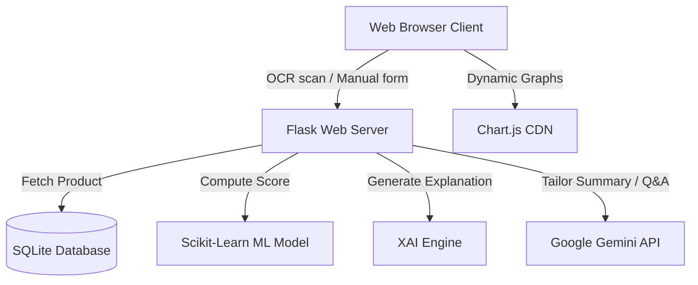
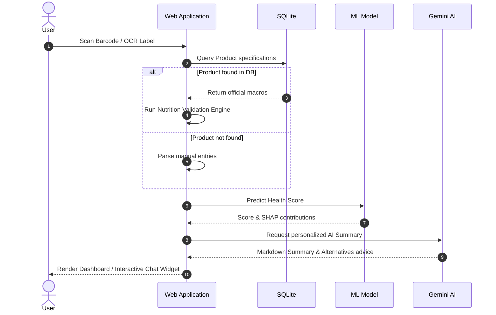

# Intelligent Food Composition & Validation System

An AI-powered, production-grade web application for analyzing packaged food products, validating label nutrition values against database specs, calculating machine learning-driven health scores, presenting explainable AI (SHAP-like) insights, and assisting users via an interactive nutrition assistant.

---

## 1. Project Overview & Problem Statement
Consumer packaged goods (CPG) often contain complex ingredients lists and nutrition labels that are difficult for average users to decipher. Additionally, discrepancies can exist between printed package information and official database parameters. 

**Objectives:**
- **Automated Validation**: Compare OCR-scanned facts against official database records.
- **Machine Learning Analysis**: Compute a health score ($1 - 100$) using Random Forest regressions.
- **Explainable AI (XAI)**: Decompose nutrient features to explain health score assignments.
- **Goal Personalization**: Suggest healthier products tailored to health objectives (e.g. Weight Loss, Diabetes, Muscle Gain, Hypertension).
- **AI Consultation**: Offer a context-aware chat assistant (Google Gemini) for real-time Q&A.

---

## 2. Technology Stack
- **Backend Framework**: Flask (Factory Pattern, Blueprints)
- **Database System**: SQLite & SQLAlchemy ORM
- **Machine Learning**: Scikit-Learn (Random Forest Regressor, cached via Joblib)
- **OCR Engine**: Tesseract.js (Client-side, hardware-accelerated thread workers)
- **AI Core**: Google Gemini API (`google-generativeai`)
- **Frontend Layer**: Vanilla CSS, Bootstrap 4, FontAwesome 6, Chart.js

---

## 3. Project Architecture & Diagrams



### Database ER Diagram
```mermaid
erDiagram
    products {
        integer id PK
        string barcode UNIQUE
        string product_name
        string brand
        string category
        text ingredients
        float calories
        float sugar
        float fat
        float saturated_fat
        float protein
        float fiber
        float sodium
        float health_score
    }
    scan_history {
        integer id PK
        string barcode FK
        datetime scanned_at
        integer product_id FK
        string status
    }
    validation_logs {
        integer id PK
        integer product_id FK
        string validation_type
        float confidence_score
        string status
        text details
        datetime logged_at
    }
    product_comparisons {
        integer id PK
        integer product_a_id FK
        integer product_b_id FK
        text notes
        datetime compared_at
    }
    
    products ||--o{ scan_history : "tracks scan history"
    products ||--o{ validation_logs : "stores validation status"
    products ||--o{ product_comparisons : "references product comparisons"
```

### Data Flow Diagram


---

## 4. Folder Structure
```
├── app/
│   ├── routes/              # Blueprint routing (main, predict, scan, compare, dashboard)
│   ├── services/            # Business logic layers (DB, ML, Warning, Validation, LLM)
│   ├── models/              # SQLAlchemy Database Models
│   ├── validation/          # Nutrient range checking validators
│   ├── utils/               # Security utilities (rate limiter, input sanitization)
│   ├── templates/           # HTML templates (Home, Dashboard, Manual, OCR, Compare, Scan)
│   ├── static/              # CSS assets, JS libraries, and logo images
│   ├── database/            # SQLAlchemy initialization
│   ├── config.py            # Environment-driven App configuration
│   └── __init__.py          # Flask Application Factory Pattern
├── scripts/
│   └── import_data.py       # DB cleaning, pre-scoring, and batch import pipeline
├── instance/
│   └── products.db          # Active SQLite Database (3,016 Cleaned Products)
├── requirements.txt         # Production-ready dependencies list
└── app.py                   # App entrypoint
```

---

## 5. Machine Learning & OCR Pipelines

### ML Pipeline
1. **Feature Engineering**: Features include Calories (kcal), Sugar (g), Fat (g), Saturated Fat (g), Protein (g), Fiber (g), and Sodium (mg) per 100g.
2. **Model Training**: Trained using a `Random Forest Regressor` on Open Food Facts dataset.
3. **SHAP Representation**: Calculates positive and negative feature contributions by finding the deviation of each nutrient from average baseline statistics:
   - Positive contributions: High fiber, protein.
   - Negative contributions: High sugar, sodium, saturated fat.

### OCR Pipeline
1. **Client-side Processing**: Tesseract.js spawns local Web Workers to extract label text directly on the user's browser, maximizing server performance.
2. **Data Extraction Regex**: Matches numeric sequences close to keyword anchors (e.g. *sugar*, *protein*, *kcal*).
3. **Discrepancy Checks**: Calculates percentage deviation between OCR values and database parameters:
   $$\text{Diff} = \frac{|\text{OCR} - \text{DB}|}{\text{DB}} \times 100$$
4. **Validation Confidence**: Computes a weighted confidence score. If deviation exceeds $20\%$, validation triggers a warning.

---

## 6. Troubleshooting & Recent Fixes
During development and testing, several startup and UI/UX obstacles were identified and resolved:

### 1. Flask Startup Blocker (Missing Dependencies)
* **Problem**: Running the Flask application caused a crash because `google-generativeai` was not installed or listed in `requirements.txt`.
* **Solution**: Added `google-generativeai>=0.3.0` to [requirements.txt](file:///c:/Users/ak/Desktop/project1/Food-Composition%20and%20validation%20system/requirements.txt) and ran `python -m pip install` to sync the package with the active Python virtual environment.

### 2. Barcode Scanner Template Crash (Jinja2 Syntax Error)
* **Problem**: Accessing the barcode scanner page returned a `500 Internal Server Error` due to incorrect Jinja syntax inside the template alternative recommendation loop:
  - `${alt.brand}` was written instead of `{{ alt.brand }}` (crashing the template engine).
  - `{{ alt.sodium}mg` was missing its closing brace.
* **Solution**: Cleaned up the template interpolation markers in [scanner.html](file:///c:/Users/ak/Desktop/project1/Food-Composition%20and%20validation%20system/app/templates/scanner.html) to follow standard server-side rendering syntax.

### 3. Database Provenance Discrepancy
* **Problem**: The raw dataset [products.csv](file:///c:/Users/ak/Desktop/project1/Food-Composition%20and%20validation%20system/products.csv) has 10,868 rows, but the active database only had 3,016 products.
* **Solution**: Confirmed that the batch cleaning pipeline ([import_data.py](file:///c:/Users/ak/Desktop/project1/Food-Composition%20and%20validation%20system/scripts/import_data.py)) runs deduplication on barcode values to enforce barcode uniqueness, and filters out missing entries, leaving exactly 3,016 unique high-quality products.

### 4. Layout Overhaul & Sticky Compact Footers
* **Problem**: Footers across the pages had excessive padding (`2.5rem`), causing them to look too bulky, and floated awkwardly in the middle of pages with short content.
* **Solution**: 
  - Standardized the layout by adding a Flexbox wrapper to the body (`min-height: 100vh; display: flex; flex-direction: column;`).
  - Added `margin-top: auto` and a narrow padding (`1rem`) to footers on all templates to make them sit cleanly at the bottom.

### 5. Small Digital Clock Widget
* **Problem**: The dashboard clock widget on the home page was too massive, disrupting the hero container layout.
* **Solution**: Scaled down fonts (Time to `1.45rem`, date to `0.8rem`, greetings to `0.85rem`) and updated the layout to a small sleek glassmorphic pill shape (`max-width: 320px`, `border-radius: 50px`).

### 6. Default Dark Mode Integration
* **Problem**: The app initialized to a light background on first load, causing a bright flash before dark mode preference checks.
* **Solution**: Added `class="dark-mode"` directly to the `<body>` element on all templates and rewrote theme storage logic to set the dark theme as default unless a user manually toggles to the light theme.

---

## 7. Installation & Environment Setup

### 1. Prerequisites
- Python 3.9+
- Gemini API Key (optional - falling back to offline mock responses if absent)

### 2. Environment Variables
Configure your environment variables before startup:
```bash
# Windows (PowerShell)
$env:GEMINI_API_KEY="your-gemini-api-key"
$env:SECRET_KEY="your-secret-key"

# Linux / MacOS
export GEMINI_API_KEY="your-gemini-api-key"
export SECRET_KEY="your-secret-key"
```

### 3. Setup Commands
```bash
# Clone the repository
git clone https://github.com/your-username/food-composition-system.git
cd food-composition-system

# Install dependencies (targeting local environment)
python -m pip install -r requirements.txt

# Run batch import & pre-scoring script (if starting fresh)
python scripts/import_data.py

# Launch the Flask server
python app.py
```

---

## 8. API Overview

### POST `/manual`
Manual entry validation, ML scoring, and AI summary.
- **Request Body:**
  ```json
  {
    "name": "Oats",
    "calories": 389,
    "sugar": 0.9,
    "fat": 6.9,
    "saturated_fat": 1.2,
    "proteins": 16.9,
    "fibers": 10.6,
    "sodium": 2.0,
    "ingredients": "Rolled oats",
    "preferences": ["Weight Loss"]
  }
  ```
- **Response Format:**
  ```json
  {
    "score": 88.5,
    "feedback": "Excellent choice! Highly nutritious.",
    "ai_summary": "...",
    "explanations": [...],
    "warnings": [...],
    "alternatives": [...]
  }
  ```

### POST `/chat`
Contextual AI nutritionist assistant.
- **Request Body:**
  ```json
  {
    "message": "Is this product good for diabetes?",
    "history": [],
    "name": "Oats",
    "calories": 389,
    "sugar": 0.9,
    "proteins": 16.9,
    "score": 88.5
  }
  ```
- **Response Format:**
  ```json
  {
    "response": "Yes, Oats are highly recommended for diabetes due to low sugar and high dietary fiber content..."
  }
  ```
